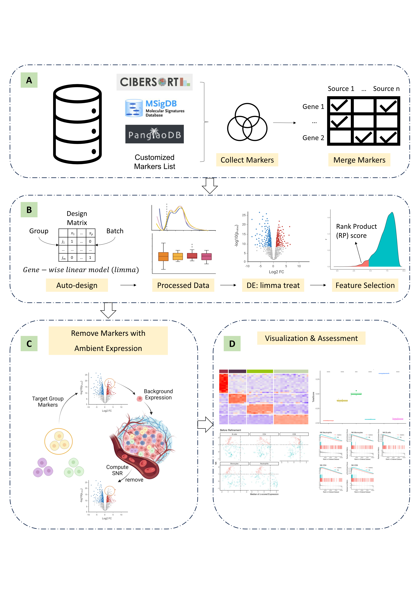

# mastR: Markers Automated Screening Tool in R

[](https://github.com/DavisLaboratory/mastR/actions)
[](https://codecov.io/github/DavisLaboratory/mastR?branch=main)
[](https://bioconductor.org/packages/mastR/)

An R package for automatically screening group specific signature for specific tissues.

mastR is an R package designed for automated screening of signatures of interest for specific research questions. The package is developed for generating refined lists of signature genes from multiple group comparisons based on the results from edgeR and limma differential expression (DE) analysis workflow.

It also takes into account the background expression of tissue-specificity, which is often ignored by other markers generation tools. The package allows users to input their expression data containing the groups of interest, along with group labels, to obtain a list of marker genes (signature) for the target group, and remove the genes with background expression from the signature.

This package is particularly useful for the identification of group markers in various biological and medical applications, including cancer research and developmental biology.

[**Check out the standard demonstration.**](https://davislaboratory.github.io/mastR/articles/mastR_Demo.html)

## Installation

mastR can be installed from Bioconductor directly as follows:

``` r
if (!requireNamespace("BiocManager", quietly = TRUE))
    install.packages("BiocManager")

BiocManager::install("mastR")
```

## Overall workflow



## References

Chen J, Mohamed A, Bhuva DD, Davis MJ, Tan CW (2025). “an R package for
automated identification of tissue-specific gene signatures in multi-group
differential expression analysis.” *Bioinformatics*, btaf114. doi:
[10.1093/bioinformatics/btaf114](https://doi.org/10.1093/bioinformatics/btaf114).
